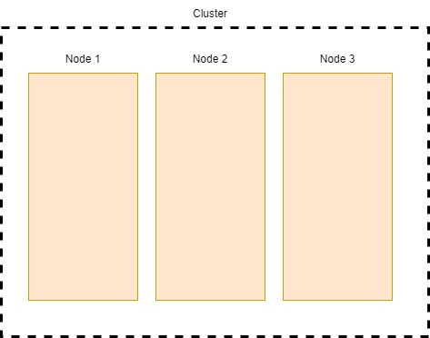
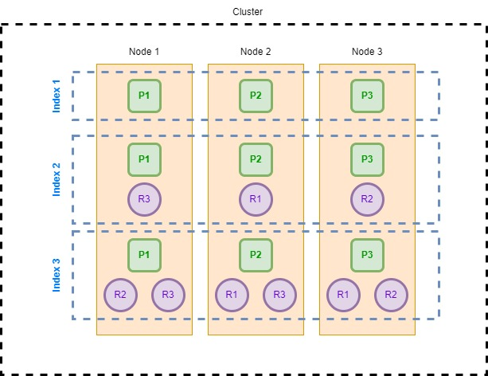

# Chapter One: Introduction

## About the Exam

---

### For who is this exam meant? 

The exam is for experienced IT professionals who can design, build, deploy, and manage any Elasticsearch solution.

### Exam Topics

* Data Management
    * Define indices and index templates.
    * Create data streams and lifecycle management policies.
* Search Data
    * Write search queries and aggregations.
* Developing Search Applications
    * Highlight, sort, and paginate search results.
    * Define index aliases.
    * Create search templates
* Data processing
    * Define mappings and custom analyzers.
    * Reindex and update documents.
    * Create and use igest pipelines.
* Cluster Management
    * Secure, diagnose, backup, and restore a cluster.
    * Configure cross-cluster search and replication.

### Exam Format

* Hands-On
    * Operate in a live environment to complete tasks in real time. (No Multiple-Choice, No True/False)
* 3 Hours
    * You will have 3 hours to complete the exam, with a 10-minute break.
* Remote
    * Take the exam remotely to avoid having to travel to a testing center.

### Preparing for the Exam

* Playground
    * Use the Cloud Playground to follow along with each lesson.
* Hands-On Labs
    * Be able to complete the hands-on labs with only the Elastic documentation.
* Quizzes
    * Take the available quizzes to reinforce important concepts and terminology.
* Practice Exam
    * Be able to complete the comprehensive practice exam within the time limit.
* Documentation
    * Be familiar with Elastic's documentation. This is your only resource during the exam!
* Rinse and Repeat
    * Revisit any content for topics that you feel weak or unsecure about.

## Elastic Stack Overview

### Beats

* Lightweight Data Shippers
    * Collect and ship data from the source. There are Beats for just about any kind or source of data you wish to collect.
* Built-In Modules
    * Pre-built configuration pipelines for well-known use cases.
* Extensible with Libbeat
    * Build your own Beat using the same foundation that all official Elastic Beats are built from.

### Logstash

* Input, parse, enrich, and output live data streams.
* Logstash is an optional component of the Elastic Stack that provides advanced data processing capabilities.

**_It is worth noting that Logstash is powerfull even outside of the Elastic Stack as a capable data processing tool._**

### Elasticsearch

* Process
    * With Elasticsearch **ingest pipelines**, you can **parse** and **enrich** data as it comes into Elasticsearch.
* Index
    * Elasticsearch's storage is **fast, high scalable**, and **fault tolerant**.
* Analyze
    * Elasticsearch can quickly **search** and **aggregate** data.

### Kibana

* Discover
    * Search, filter, and view data stored in the attached Elasticsearch cluster.
* Visualize
    * Craft informative visualizations from Elasticsearch data.
* Dashboard
    * Combine visualizations and search into a single pane of glass.
* Time Series Visual Builder (TSVB)
    * Create purpose-built time series-based visualizations.
* Machine Learning
    * Discover and visualize hidden insights and anomalies within Elasticsearch data.
* And Much More
    * APM, uptime monitoring, SIEM, stack monitoring, and more are also possible with Kibana.

## Elasticsearch Overview

### Cluster

_A collection of one or more nodes._

A **Cluster** is a distributed entity which allows for horizontal scaling and redundancy.

### Nodes

_Each node has a set of defined roles._

* **Master-eligable** nodes can be elected as the **master** node which coordinates the cluster.
* **Data** nodes index, store, and analyze data.
* **Ingest** nodes can collect and process data.

### Indices

* **Primary** shards contain a portion of the index.
* **Replica** shards are copies of a primary shard.
* Replica shards **cannot** allocate to the same node of their primary shard.
* Replica shards provide redundancy and increased search throughput.

### Cluster States

_Based on shard allocation._

* **Green** state means all primary and replica shards are allocated.
* **Yellow** state means all primary shards, but **not** all replica shards, are allocated.
* **Red** state means not all primary shared are allocated.

**_Cluster state will always be the state of the WORST state of an index inside the cluster._**