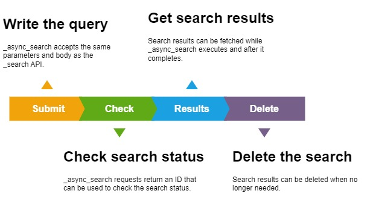
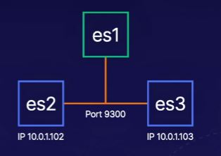

<!-- omit from toc -->
# Searching Data

- [Introduction to Searching Data](#introduction-to-searching-data)
- [Understanding the Elasticsearch Query DSL](#understanding-the-elasticsearch-query-dsl)
  - [Sorting Analyzed Fields](#sorting-analyzed-fields)
    - [Analyzed: Search Matches](#analyzed-search-matches)
    - [Non-Analyzed: Search Matches](#non-analyzed-search-matches)
  - [Relevancy Scoring](#relevancy-scoring)
  - [Query and Filter Context](#query-and-filter-context)
    - [Query Context](#query-context)
    - [Filter Context](#filter-context)
- [Writing Term-Level Queries](#writing-term-level-queries)
  - [Examples Term-level Search](#examples-term-level-search)
    - [Single value](#single-value)
    - [Multiple values](#multiple-values)
    - [Range](#range)
- [**(LAB)** Searching with Term-Level Queries in Elasticsearch 7.13](#lab-searching-with-term-level-queries-in-elasticsearch-713)
  - [Objectives](#objectives)
  - [Solution](#solution)
    - [Question 1:](#question-1)
    - [Question 2:](#question-2)
    - [Question 3:](#question-3)
- [Writing Full-Text Search Queries](#writing-full-text-search-queries)
  - [Examples Full-Text Search](#examples-full-text-search)
    - [Single value](#single-value-1)
    - [Phrase value](#phrase-value)
- [**(LAB)** Searching with Full-Text Queries in Elasticsearch 7.13](#lab-searching-with-full-text-queries-in-elasticsearch-713)
  - [Objectives](#objectives-1)
  - [Solution](#solution-1)
    - [Question 1:](#question-1-1)
    - [Question 2:](#question-2-1)
    - [Question 3:](#question-3-1)
- [Writing Compound Search Queries](#writing-compound-search-queries)
  - [Boolean Query](#boolean-query)
  - [Examples Boolean Queries](#examples-boolean-queries)
    - [must \& should](#must--should)
- [**(LAB)** Combining Queries with Compound Searching in Elasticsearch 7.13](#lab-combining-queries-with-compound-searching-in-elasticsearch-713)
  - [Objectives](#objectives-2)
  - [Solution](#solution-2)
    - [Objective 1:](#objective-1)
    - [Objective 2:](#objective-2)
    - [Objective 3:](#objective-3)
- [Executing Asynchronous Search Queries](#executing-asynchronous-search-queries)
  - [Async Search](#async-search)
  - [Examples Async Search](#examples-async-search)
    - [Create Async Search](#create-async-search)
    - [Check status of Async Search](#check-status-of-async-search)
    - [Get Async Search results](#get-async-search-results)
    - [Delete Async Search results](#delete-async-search-results)
- [**(LAB)** Asynchronously Searching in Elasticsearch 7.13](#lab-asynchronously-searching-in-elasticsearch-713)
  - [Objectives](#objectives-3)
  - [Solution](#solution-3)
    - [Create Search](#create-search)
    - [Check status](#check-status)
    - [Delete results](#delete-results)
- [Executing Cross-Cluster Search Queries](#executing-cross-cluster-search-queries)
  - [Configuring a remote cluster](#configuring-a-remote-cluster)
  - [Searching against remote cluster's index](#searching-against-remote-clusters-index)
- [**(LAB)** Search Across Multiple Clusters in Elasticsearch 7.13](#lab-search-across-multiple-clusters-in-elasticsearch-713)
  - [Objectives](#objectives-4)
  - [Solution](#solution-4)
    - [Setup remote clusters](#setup-remote-clusters)
    - [Search Simultaneously on all Clusters](#search-simultaneously-on-all-clusters)
- [**(QUIZ)** Searching Data in Elasticsearch 7.13](#quiz-searching-data-in-elasticsearch-713)

## Introduction to Searching Data

* Understanding the Elasticsearch Query DSL
* Writing Term-Level Search Queries
* Writing Full-Text Search Queries
* Writing Compound Search Queries
* Executing Asyncronous Search Queries
* Executing Cross-Cluster Search Queries

## Understanding the Elasticsearch Query DSL

_DSL = Domain Specific Language_

### Sorting Analyzed Fields

_**Original:** The students leanerd a NEW concept._

* **Analyzed**
  * Original text is tokenized into keywords
    * students | learned | NEW | concept
  * Normalized Tokens (Lowercased, base word...)
    * student | learn | new | concept
* **Non-Analyzed**
  * Original text is tokenized in a full sentence (original text)
    * The students learned a NEW concept.
  * Normalized Tokens (Optional)
    * the students learned a new concept.

#### Analyzed: Search Matches

_**Stored Fields:** student | learn | new | concept_

* Students.
* New concepts.
* How to learn?
* Learning new ideas.
* Never stop learning!
* Newer concepts.
* Training new students.
* Students learning new concepts.
* Learning.
* Understanding fresh ideas.
  * This is a match because of synonyms
  
#### Non-Analyzed: Search Matches

_**Stored Fields:** The students learned a NEW concept.

* The students learned a NEW concept.
  * Only find this if searched for by the exact text.

### Relevancy Scoring

_How well a search matches a document._

* **Term Frequency**
  * How often does the term appear in the **field**?
* **Inverse Document Frequency**
  * How often does the term appear in the **index**?
* **Field-Length Normalization**
  * How many terms are in the field?

### Query and Filter Context

#### Query Context

* **Q:** How well does the search clause match the document?
  * **A:**_<relevancy_score>_
  
#### Filter Context

* **Q:** Does the search clause match the document?
  * **A:** _true_ or _false_

_The search clause using Filter Context, does not have any effect on the relevancy score!_

## Writing Term-Level Queries

_Search for documents based on exact values._

* Term-level queries do not analyze search terms.
* Search terms can be normalized for term-level queries.
* Avoid using term-level queries on analyzed fields.

### Examples Term-level Search

#### Single value

    GET flights/_search
    {
      "query": {
        "term": {
          "DestCountry": {
            "value": "US"
          }
        }
      }
    }

_Query used to get documents with one specific value (DestCountry = US)._

#### Multiple values

    GET flights/_search
    {
      "query": {
        "terms": {
          "Carrier": [
            "Kibana Airlines",
            "Logstash Airways"
          ]
        }
      }
    }

_Query used to get documents with multiple possible values (Carrier = Kibana Airlines or Carrier = Logstash Airways)._

#### Range

_For time ranges, absolute values are also possible!_

    GET flights/_search
    {
      "query": {
        "range": {
          "AvgTicketPrice": {
            "gte": 200,
            "lt": 300
          }
        }
      }
    }

_Query used to get documents with a value between x and y (AvgTicketPrice >= 200 & AvgTicketPrice < 300)._

    GET flights/_search
    {
      "query": {
        "range": {
          "timestamp": {
            "gte": "now-1h",
            "lte": "now"
          }
        }
      }
    }

_Query used to get all documents with a timestamp starting of 1h before until the current time._

    GET flights/_search
    {
      "query": {
        "range": {
          "timestamp": {
            "gte": "now-1d/d",
            "lte": "now"
          }
        }
      }
    }

_Query used to get all documents of 24h ago until today, but round off to the nearest day (whole of yesterday)._

## **(LAB)** Searching with Term-Level Queries in Elasticsearch 7.13

### Objectives

The following questions should be answered from the **ecommerce** dataset:

* What was the customer that placed order **order ID 725676**?
* From what **cities** did **Samir Garza**, **Selena Gibbs**, and **Tariq Duncan** place orders?
* What orders where placed with a **total taxed price** of **10 to 20** euro?

### Solution

#### Question 1:

_**Answer:** Elyssa Estrada_

_**Query:**_

    GET ecommerce/_search
    {
      "query": {
        "term": {
          "order_id": {
            "value": "725676"
          }
        }
      }
    }

#### Question 2:

_**Answer:** Samir --> Dubai, Selena --> Marrakesh, Tariq --> Istanbul_

_**Query:**_

    GET ecommerce/_search
    {
      "query": {
        "terms": {
          "customer_full_name.keyword": [
            "Samir Garza",
            "Selena Gibbs",
            "Tariq Duncan"
          ]
        }
      }
    }

#### Question 3:

_**Answer:** To much to write down (35 hits)._

_**Query:**_

    GET ecommerce/_search
    {
      "query": {
        "range": {
          "taxful_total_price": {
            "gte": 10,
            "lte": 20
          }
        }
      }
    }

## Writing Full-Text Search Queries

_Search for documents based on analyzed values._

* The query is processed using the same analyzer as the text field.
* Text fields can be indexed and searched using custom analyzers.
* Avoid using full-text queries on non-analyzed fields.

### Examples Full-Text Search

#### Single value

    GET shakespeare/_search
    {
      "query": {
        "match": {
          "text_entry": "King"
        }
      }
    }

_Query used to return documents where the text_entry field contains 'King' based on normalized tokens, displayed top 10 ordered by relevancy score._

#### Phrase value

    GET shakespeare/_search
    {
      "query": {
        "match_phrase": {
          "text_entry": "wherefore art thou romeo"
        }
      }
    }

_Query used to get documents where a specific pharse is present._

## **(LAB)** Searching with Full-Text Queries in Elasticsearch 7.13

### Objectives

The following questions should be answered from the **sharespeare** dataset:

* How many **lines** from Shakespeare's plays reference **love**?
* How many **lines** from Sharespeare's plays reference **hate**?
* What is the **play** and **line number** where "**to be, or not to be**" is spoken?

### Solution

#### Question 1:

_**Answer:** 1857_

_**Query:**_

    GET shakespeare/_search
    {
      "query": {
        "match": {
          "text_entry": "love"
        }
      }
    }

#### Question 2:

_**Answer:** 158_

_**Query:**_

    GET shakespeare/_search
    {
      "query": {
        "match": {
          "text_entry": "hate"
        }
      }
    }

#### Question 3:

_**Answer:** play --> Hamlet, line number --> 3.1.64_

_**Query:**_

    GET shakespeare/_search
    {
      "query": {
        "match_phrase": {
          "text_entry": "to be, or not to be"
        }
      }
    }

## Writing Compound Search Queries

### Boolean Query

_Search for documents matching a boolean combination of queries._

With boolean queries, the score of **must** and **should** clauses will be added together to calculate the final relevancy score for each result.

* **must**: The search term **must** appear and is scored.
* **should**: The search term **should** appear and is scored. You can configure how many should clauses must match.
* **must_not**: The search term **must not** appear and is not scored.
* **filter**: The search term **must** appear and is not scored.

### Examples Boolean Queries

#### must & should

    GET ecommerce/_search
    {
      "query": {
        "bool": {
          "must": [
            {
              "range": {
                "taxful_total_price": {
                  "lte": 20
                }
              }
            }
          ],
          "should": [
            {
              "term": {
                "category.keyword": {
                  "value": "Men's Clothing"
                }
              }
            },
            {
              "term": {
                "category.keyword": {
                  "value": "Men's Shoes"
                }
              }
            }
          ],
          "minimum_should_match": 1,
          "must_not": [
            {
              "match": {
                "products.product_name": "sweatshirt"
              }
            }
          ]
        }
      }
    }

_Query that will return documents where the 'taxfull_total_price' **MUST** be <= 20, and where the category **SHOULD** match atleast one of the 'term' queries (Men's Clothing or Men's Shoes) and the 'product_name' **MUST NOT** match 'sweatshirt'._

## **(LAB)** Combining Queries with Compound Searching in Elasticsearch 7.13

### Objectives

The following should be queried from the **logs** dataset:

* Find all web requests **originating** from either **US** or **CN** where **response** was not **200**.
* Find all web requests with a **200 response** that has at least two **tags** with **success**, **security**, or **info** value and is not from a machine with a **windows operation system**.
* Find all web **requests** made for **apm-server rpm** or **deb files** by users using an **osx operation system**. Filter down the results to only include files between **1024** and **8192 bytes** without effecting relevancy scoring.

### Solution

#### Objective 1:

    GET logs/_search
    {
      "query": {
        "bool": {
          "must": [
            {
              "terms": {
                "geo.src": [
                  "US",
                  "CN"
                ]
              }
            }
          ],
          "must_not": [
            {
              "term": {
                "response.keyword": {
                  "value": "200"
                }
              }
            }
          ]
        }
      }
    }

#### Objective 2:

    GET logs/_search
    {
      "query": {
        "bool": {
          "must": [
            {
              "term": {
                "response.keyword": {
                  "value": "200"
                }
              }
            }
          ],
          "should": [
            {
              "term": {
                "tags.keyword": {
                  "value": "success"
                }
              }
            },
            {
              "term": {
                "tags.keyword": {
                  "value": "security"
                }
              }
            },
            {
              "term": {
                "tags.keyword": {
                  "value": "info"
                }
              }
            }
          ],
          "minimum_should_match": 2,
          "must_not": [
            {
              "match": {
                "machine.os": "win"
              }
            }
          ]
        }
      }
    }

#### Objective 3:

    GET logs/_search
    {
      "query": {
        "bool": {
          "must": [
            {
              "match_phrase_prefix": {
                "request": "apm-server"
              }
            },
            {
              "terms": {
                "extension.keyword": [
                  "rpm",
                  "deb"
                ]
              }
            },
            {
              "term": {
                "machine.os.keyword": {
                  "value": "osx"
                }
              }
            }
          ],
          "filter": [
            {
              "range": {
                "bytes": {
                  "gte": 1024,
                  "lte": 8192
                }
              }
            }
          ]
        }
      }
    }

## Executing Asynchronous Search Queries

### Async Search

### Examples Async Search

#### Create Async Search

    POST ecommerce/_async_search?wait_for_completion_timeout=0
    {
      "query": {
        "bool": {
          "must": [
            {
              "range": {
                "taxful_total_price": {
                  "lte": 20
                }
              }
            }
          ],
          "should": [
            {
              "term": {
                "category.keyword": {
                  "value": "Men's Clothing"
                }
              }
            },
            {
              "term": {
                "category.keyword": {
                  "value": "Men's Shoes"
                }
              }
            }
          ],
          "minimum_should_match": 1,
          "must_not": [
            {
              "match": {
                "products.product_name": "sweatshirt"
              }
            }
          ],
          "filter": [
            {
              "range": {
                "order_date": {
                  "gte": "now/d",
                  "lte": "now"
                }
              }
            }
          ]
        }
      }
    }

_**Note:** ?wait_for_completion_timeout=0 is currently used to force it as async search, because the dataset is to small and result is fetched to fast._

#### Check status of Async Search

    GET _async_search/status/<ID>

_<ID> is the ID that is generated after the creation of the Async Search._

#### Get Async Search results

    GET _async_search/<ID>

#### Delete Async Search results

    DELETE _async_search/<ID>

## **(LAB)** Asynchronously Searching in Elasticsearch 7.13

### Objectives

The **filebeat-7.13.4** dataset should be queried with the following criteria:

* Asynchronously search for log messages that mention **SSH**.
* The **wait_for_completion_timeout** parameter should be set to **0**.
* The search should be configured for a hits array size of **100**.

Using the async search ID, you will check on the **status** of the search until it is complete. Then, get the search **results** and **delete** the search.

### Solution

#### Create Search

    POST filebeat-7.13.4/_async_search?wait_for_completion_timeout=0
    {
      "size": 100, 
      "query": {
        "match": {
          "message": "SSH"
        }
      }
    }

#### Check status

    GET _async_search/status/<ID>

#### Delete results

    DELETE _async_search/status/<ID>

## Executing Cross-Cluster Search Queries

_Run a search request against 1 or more remote clusters._

You can search remote clusters that are 1 major version behind or ahead of the coorinating node.

### Configuring a remote cluster

    PUT _cluster/settings
    {
      "persistent": {
        "cluster": {
          "remote": {
            "cluster_2": {
              "seeds": ["172.31.107.70:9300"]
            }
          }
        }
      }
    }

_The IP address in the 'seeds' array is the Private IPv4 address of the new cluster._

### Searching against remote cluster's index

    GET cluster_2:filebeat-7.13.4/_search
    {
      "query": {
        "range": {
          "@timestamp": {
            "gte": "now-1h",
            "lte": "now"
          }
        }
      }
    }

_The 'cluster_2' is the name given to the earlier defined remote cluster. This will return a concatenation of both clusters's results._

## **(LAB)** Search Across Multiple Clusters in Elasticsearch 7.13

### Objectives

Configure cross-cluster search from the **es1** cluster to the **es2** and **es3** clusters as shown below:

Query the **metricbeat-7.13.4** dataset on all clusters simultaneously from the **es1** cluster.

### Solution

#### Setup remote clusters

    PUT _cluster/settings
    {
      "persistent": {
        "cluster": {
          "remote": {
            "cluster_2": {
              "seeds":["10.0.1.102:9300"]
            },
            "cluster_3": {
              "seeds":["10.0.1.103:9300"]
            }
          }
        }
      }
    }

#### Search Simultaneously on all Clusters

    GET metricbeat-7.13.4,cluster_2:metricbeat-7.13.4,cluster_3:metricbeat-7.13.4/_search

## **(QUIZ)** Searching Data in Elasticsearch 7.13

* **Which of the following is an analyzed search query?**
  * match
* **Which of the following is the proper syntax for executing a search on multiple clusters?**
  * GET index_1,cluster_2:index_2/_search
* **Which of the following is a term-level, non-analyzed search query?**
  * range
* **Which of the following is not true about asynchronous search requests?**
  * Asynchronous search requests can only perform term-level, non-analyzed search queries.
* **In which bool query clause would you craft a search query where the search term must appear but is not relevancy scored?**
  * filter
* **Which query would you use to perform a full-text analyzed search for a particular phrase?**
  * match_phrase