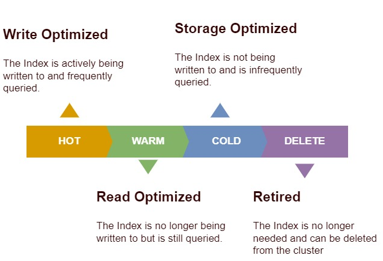

<!-- omit from toc -->
# Chapter Two: Managing Data

- [Introduction to Managing Data](#introduction-to-managing-data)
- [Defining Indices](#defining-indices)
  - [Index Anatomy](#index-anatomy)
  - [Create Indices](#create-indices)
  - [Remove Indices](#remove-indices)
  - [Create Indices with Settings](#create-indices-with-settings)
  - [Get info from Indices](#get-info-from-indices)
- [**(LAB)** Creating Indices in Elasticsearch 7.13](#lab-creating-indices-in-elasticsearch-713)
  - [Objective](#objective)
  - [Solution](#solution)
    - [Create the indices](#create-the-indices)
    - [Check if the indices have a green state](#check-if-the-indices-have-a-green-state)
- [Defining Index Templates](#defining-index-templates)
  - [Creating an Index Template](#creating-an-index-template)
  - [Creating a Compenent Template](#creating-a-compenent-template)
  - [Creating Index Template using Component Template](#creating-index-template-using-component-template)
- [**(LAB)** Creating Index Templates in Elasticsearch 7.13](#lab-creating-index-templates-in-elasticsearch-713)
  - [Objectives](#objectives)
  - [Solution](#solution-1)
    - [Create the Index Templates](#create-the-index-templates)
    - [Check if Index Template is working](#check-if-index-template-is-working)
    - [Check if the indices have a green state](#check-if-the-indices-have-a-green-state-1)
- [Using the Data Visualizer to Upload Data](#using-the-data-visualizer-to-upload-data)
  - [Upload Data](#upload-data)
- [**(LAB)** Uploading Data with the Data Visualizer in Elasticsearch 7.13](#lab-uploading-data-with-the-data-visualizer-in-elasticsearch-713)
  - [Objectives](#objectives-1)
  - [Solution](#solution-2)
- [Establishing an Index Lifecycle Management (ILM) Policy](#establishing-an-index-lifecycle-management-ilm-policy)
  - [Index Lifecycle](#index-lifecycle)
  - [Creating an Index Lifecycle Management Policy](#creating-an-index-lifecycle-management-policy)
  - [Assigning a ILM Policy to an Index Template](#assigning-a-ilm-policy-to-an-index-template)
- [**(LAB)** Managing Indices with Index Lifecycle Management (ILM) in Elasticsearch 7.13](#lab-managing-indices-with-index-lifecycle-management-ilm-in-elasticsearch-713)
  - [Objectives](#objectives-2)
  - [Solution](#solution-3)
    - [Create the ILM Policy](#create-the-ilm-policy)
    - [Create Index Template](#create-index-template)
    - [Create Index](#create-index)
- [Creating Data Streams](#creating-data-streams)
  - [Data Streaming](#data-streaming)
  - [Create ILM policy](#create-ilm-policy)
  - [Creating Index Template](#creating-index-template)
  - [Start a Data Stream](#start-a-data-stream)
- [**(LAB)** Streaming Data in Elasticsearch 7.13](#lab-streaming-data-in-elasticsearch-713)
  - [Objectives](#objectives-3)
  - [Solution](#solution-4)
    - [Create the apache\_policy ILM policy](#create-the-apache_policy-ilm-policy)
    - [Create the apache\_template index template](#create-the-apache_template-index-template)
    - [Start and verify the apache\_stream data stream](#start-and-verify-the-apache_stream-data-stream)
- [**(QUIZ)** Managing Data in Elasticsearch 7.13](#quiz-managing-data-in-elasticsearch-713)

## Introduction to Managing Data

* Defining Indices
* Defining Index Templates
* Using the Data Visualizer to Upload Data
* Establishing an Index Lifecycle Management (ILM) Policy
* Creating Data Streams

## Defining Indices

### Index Anatomy

* Aliases
    * Aliases allow us to simplify how we reference one or many indices.
* Mappings
    * Mappings allow us to dynamically or explicitly determine how our data is indexed
* Settings
    * Settings allow us to customize index behavior and allocation.

### Create Indices

To create an index, you can simple send a PUT call with the name of the new index in the Kibana Dev Tools:

        PUT earthquakes

This will return a response like so:

        {
            "acknowledged" : true,
            "shards_acknowledged" : true,
            "index" : "earthquakes"
        }

 _(Note: This will allocate a **yellow** state to the indices because we are working with a single-node cluster, so replicas cannot be allocated on the same node)_

### Remove Indices

To remove an index, you can send a DELETE call with the name of the index you want to remove:

        DELETE earthquakes

This will return a response like so: 

        {
            "acknowledged" : true
        }

### Create Indices with Settings

To create an index with custom settings, send a PUT call with body data:

        PUT earthquakes
        {
            "settings": {
                "number_of_shards": 1,
                "number_of_replicas": 0
            }
        }

### Get info from Indices

To see the basic configuration on the indices, make a GET call with the name of the desired index

        GET earthquakes

This will give you a response like so:

        {
            "earthquakes" : {
                "aliases" : { },
                "mappings" : { },
                "settings" : {
                "index" : {
                    "routing" : {
                    "allocation" : {
                        "include" : {
                        "_tier_preference" : "data_content"
                        }
                    }
                    },
                    "number_of_shards" : "1",
                    "provided_name" : "earthquakes",
                    "creation_date" : "1688383941815",
                    "number_of_replicas" : "0",
                    "uuid" : "9zBsH5DEQ_-KsUYs_H2iEg",
                    "version" : {
                    "created" : "7130499"
                    }
                }
                }
            }
        }

## **(LAB)** Creating Indices in Elasticsearch 7.13

### Objective

The following indices should be created and allocated with a **green** state:

* leads_b2b-000001
* leads_b2c-000001
* sales_b2c-000001

Because this is a single-node cluster, you will need to set the primary shards to **1** and the replica shards to **0** in order to achieve a **green* state of each index.

### Solution

#### Create the indices

        PUT leads_b2b-000001
        {
            "settings": {
                "number_of_shards": 1,
                "number_of_replicas": 0
            }
        }

_Do this for all three indices_

#### Check if the indices have a green state

        GET _cat/indices

With reponse:

        green open leads_b2c-000001                    mt3UXltzQRGEzW9BJte-7g 1 0      0    0    208b    208b
        green open leads_b2b-000001                    cNvL7aaUR0qR2RC_eO3Paw 1 0      0    0    208b    208b
        green open sales_b2c-000001                    VXbEClboRzSSk_hLEv23Qw 1 0      0    0    208b    208b

## Defining Index Templates

_Intelligently manage your Elasticsearch indices._

* Index Patterns
    * Automatically manage any index that matches the index pattern
* Advanced Features
    * Data streams, index lifecycle management, snapshotting, etc.
* Component Templates
    * Reusable building blocks for constructing index templates.

### Creating an Index Template

To create an index template, simply send a PUT call with some body data:

        PUT _index_template/earthquakes
        {
        "index_patterns": ["earthquakes-*"],
            "template": {
                "settings": {
                "number_of_shards": 1,
                "number_of_replicas": 0
                }
            }
        }

_This will create an index template that will enfore the given settings to all new indices that match 'earthquakes-*' (ex: earthquakes-1, eathquakes-2, etc)_

### Creating a Compenent Template

To create a Component Template, send a PUT call with some settings you want to enfore:

        PUT _component_template/shards
        {
            "template": {
                "settings": {
                "number_of_shards": 1,
                "number_of_replicas": 0
                }
            }
        }

_This will create a component template called 'shards', we can now use this component template when we create an index template so we do not have to specifiy the settings everytime_

### Creating Index Template using Component Template

        PUT _index_template/earthquakes
        {
            "index_patterns": ["earthquakes-*"],
            "composed_of": ["shards"]
        }

## **(LAB)** Creating Index Templates in Elasticsearch 7.13

### Objectives

The following index templates should be created and should allocate all matched indices with a **green** state:

* **load** matches indices that start with **load-**
* **cpu** matches indices that start with **cpu-**
* **memory** matches indices that start with **memory-**

Because this is a single-node cluster, you will need to configure the index templates to create all indices with **1** primary and **0** replica shards to ensure the indices that use these templates are allocated with a **green** state.

### Solution

#### Create the Index Templates

        PUT _index_template/load
        {
            "index_patterns": ["load-*"],
            "template": {
                "settings": {
                "number_of_shards": 1,
                "number_of_replicas": 0
                }
            }
        }

_Do this for all three Index Templates_

#### Check if Index Template is working

        PUT load-1
        GET load-1

_Do this for all three Index Templates, the GET call should return a response where you will find the defined shards and replica settings._

#### Check if the indices have a green state

        GET _cat/indices

With response:

        green open load-1                              87wFC0lMR8qQLC9BUJoQNg 1 0      0    0    208b    208b
        green open cpu-1                               mBDt0RpoTxO7Bq7SbNqLGg 1 0      0    0    208b    208b
        green open memory-1                            PgAmJjnnS2SqRrH3MHKWEQ 1 0      0    0    208b    208b

## Using the Data Visualizer to Upload Data

_Great for ad-hoc data analysis._

Understand the fields of a dataset by quickly uploading and analyzing it in order to determine whether or not to ingest it into Elasticsearch.

**File Formats:**

* Delimited text files (CSV, TSV)
* Newline-delimeted JSON (NDJSON)
* Log Files (Consistent format!)

### Upload Data

* Navigate to "Machine Learning > Data Visualizer".
* Upload data file. _(I use the demo file of the course 'earthquakes.csv' located in [assets](./Assets/))_
* Click "Import".
* Give the new Index a name.
* Go to the "Advanced" tab and add '"number_of_replicas": 0' under 'Index settings'. _(Once again, because we are using a single-node cluster)_
* Click "Import".

## **(LAB)** Uploading Data with the Data Visualizer in Elasticsearch 7.13

### Objectives

* The **malicious_urls** dataset should be imported into Elasticsearch.
* The **malicious_urls** dataset should be allocated with a **green** state.

### Solution

* Navigate to "Machine Learning > Data Visualizer".
* Upload the 'malicious_urls.csv' dataset located at [Assets](./Assets/).
* Click "Import" and enter 'malicious_urls' as Index name.
* Add again the 'number_of_replicas: 0' to the Advanced options.
* Under "Management" select "Dev Tools"
    * Check if the new Index is allocated a **green** state
        * GET _cat/indices
        * green open malicious_urls                      5rLl6h8iS0yLKSRqBQ0S4A 1 0  99999    0  10.7mb  10.7mb

## Establishing an Index Lifecycle Management (ILM) Policy

_Automatically manage your indices based on your usage requirements_

* Phases
    * Prioritize your data based on how you use it with, warm, cold, and delete phases.
* Phase Transitions
    * Move indices through the lifecycle based on age, size, or document count.
* Phase Executions
    * Perform actions on indices at each phase, like rollover, force merge, migrate, shrink, freeze, and delete.

### Index Lifecycle

### Creating an Index Lifecycle Management Policy

To create a ILM Policy, send a PUT call with the correct configured options:

        PUT _ilm/policy/applogs
        {
            "policy": {
                "phases": {
                "hot": {
                    "actions": {}
                },
                "warm": {
                    "min_age": "1d",
                    "actions": {
                    "forcemerge": {
                        "max_num_segments": 1
                    }
                    }
                },
                "cold": {
                    "min_age": "7d",
                    "actions": {
                    "freeze": {}
                    }
                },
                "delete": {
                    "min_age": "30d",
                    "actions": {
                    "delete": {}
                    }
                }
                }
            }
        }

_This ILM policy will immidiatly put new data in the "hot" phase, after 1 day this data will be moved to the 'warm' stage and merged into one segment (data is stored in segments, by merging it to one segment, it increases read performance). When the data enters the 'cold' stage after seven days, it will be frozen (unallocation it from the memory), you will not be able to write to the index anymore it will be read-only. Finally after a month the data will be enter the 'delete' phase and therefor being deleted._

### Assigning a ILM Policy to an Index Template

        PUT _index_template/applogs
        {
            "index_patterns": ["applogs-*"],
            "composed_of": ["shards"],
            "template": {
                "settings": {
                "index.lifecycle.name": "applogs"
                }
            }
        }

## **(LAB)** Managing Indices with Index Lifecycle Management (ILM) in Elasticsearch 7.13

### Objectives

The **audit_policy** Index Management (ILM) Policy should be created with the following criteria:

* **hot** phase: no actions
* **cold** phase: **min_age** of **7** days, **freeze**, **readonly**
* **delete** phase: **min_age** of **365** days, **delete**

The **audit_template** index templates should be created to match all indices that start with **audit-**. Because this is a single-node cluster, you will need to set the primary shards to **1** and the replica shards to **0** in order to achieve a **green** state for each index.

The **audit-MM-DD-YYYY** index should be created substituting in the current date.

### Solution

#### Create the ILM Policy

        PUT _ilm/policy/audit_policy
        {
            "policy": {
                "phases": {
                "hot": {
                    "actions": {}
                },
                "cold": {
                    "min_age": "7d",
                    "actions": {
                    "freeze": {},
                    "readonly": {}
                    }
                },
                "delete": {
                    "min_age": "365d",
                    "actions": {
                    "delete": {}
                    }
                }
                }
            }
        }

#### Create Index Template

        PUT _index_template/audit_template
        {
            "index_patterns": ["audit-*"],
            "template": {
                "settings": {
                "number_of_shards": 1,
                "number_of_replicas": 0,
                "index.lifecycle.name": "audit_policy"
                }
            }
        }

#### Create Index

        PUT audit-07-03-2023

## Creating Data Streams

### Data Streaming

_Store and search time series data spread across multiple indices with a single resource._

* Backing indices store the actual data, but the data stream abstracts them.
* Search requests made to a data stream are directed to all backing indices.
* Indexing to a data stream gets routed to the latest index (hot) in the stream.

_To create a Data Stream, you need an ILM policy and an Index Template_

### Create ILM policy

_When working with Data Streams, you **MUST** have a 'rollover' in the ILM._

        PUT _ilm/policy/weblogs
        {
            "policy": {
                "phases": {
                "hot": {
                    "actions": {
                    "rollover": {
                        "max_primary_shard_size": "5gb"
                    },
                    "forcemerge": {
                        "max_num_segments": 1
                    }
                    }
                },
                "cold": {
                    "min_age": "7d",
                    "actions": {
                    "freeze": {}
                    }
                },
                "delete": {
                    "min_age": "30d",
                    "actions": {
                    "delete": {}
                    }
                }
                }
            }
        }

_'forcemerge' in 'hot' phase is only possible when 'rollover' is present, this will merge when the index 'rollsover'. Note that working with 'rollover' will change the behavior of the 'min_age' object at the 'cold' phase, the 'min_age' starts from the point of 'rollover' and so on._

### Creating Index Template

        PUT _index_template/weblogs
        {
            "index_patterns": ["weblogs"],
            "data_stream": {},
            "composed_of": ["shards"],
            "template": {
                "settings": {
                "index.lifecycle.name": "weblogs"
                }
            }
        }

_**Note:** The index_patterns when working with Data Streams is the name of the Data Stream._

### Start a Data Stream

_You don't use Indices, but you just start a Data Stream._

        PUT _data_stream/weblogs

_Now you can search against 'weblogs', this will automatically search the correct indices._

## **(LAB)** Streaming Data in Elasticsearch 7.13

### Objectives

The **apache_policy** Index Lifecycle Management (ILM) Policy should be created with the following criteria:

* **rollover** at a maximum primary shard size of **5 GB**.
* **forcemerge** rolled over indices into **1** segment.
* Set rolled over indices to **readonly**.
* **delete** indices with a maximum age of **90** days.

The **apache_template** index template should be created to use the **apache_stream** Data Stream and the **apache_policy** ILM policy. Because the is a single-node cluster, you will need to set the primary shards to **1** and the replica shards to **0** in order to achieve a **green** state for each index.

Lastly, the **apache_stream** should be started and verified.

### Solution

#### Create the apache_policy ILM policy

        PUT _ilm/policy/apache_policy
        {
            "policy": {
                "phases": {
                "hot": {
                    "actions": {
                    "rollover": {
                        "max_primary_shard_size": "5gb"
                    },
                    "forcemerge": {
                    "max_num_segments": 1 
                    },
                    "readonly": {}
                    }
                },
                "delete": {
                    "min_age": "90d",
                    "actions": {
                    "delete": {}
                    }
                }
                }
            }
        }

#### Create the apache_template index template

        PUT _index_template/apache_template
        {
            "index_patterns": ["apache_stream"],
            "data_stream": {},
            "template": {
                "settings": {
                "number_of_shards": 1,
                "number_of_replicas": 0,
                "index.lifecycle.name": "apache_policy"
                }
            }
        }

#### Start and verify the apache_stream data stream

        PUT _data_stream/apache_stream

        GET _data_stream/apache_stream

## **(QUIZ)** Managing Data in Elasticsearch 7.13

* **When configuring an index template to manage a data stream, what should the index pattern be?**
  * The name of the data stream.
* **Which index lifecycle management (ILM) phase is intended for read-optimized data that is no longer indexed to but is still frequently searched?**
  * Warm
* **What 3 main components make up an index's anatomy?**
  * Aliases, mappings, and settings
* **What file type is not supported by the data visualizer?**
  * YAML
* **Which of the following cannot be configured within an index template?**
  * Search query